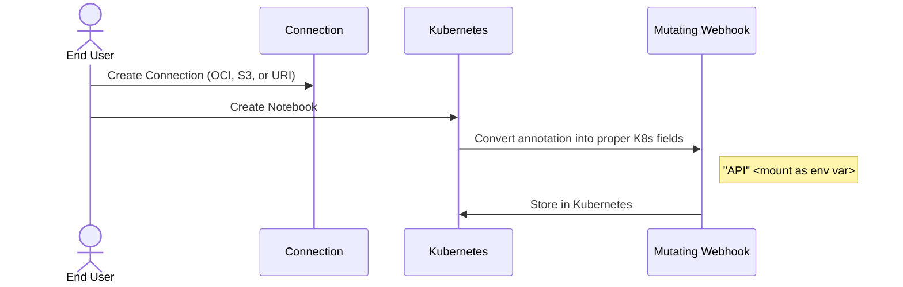
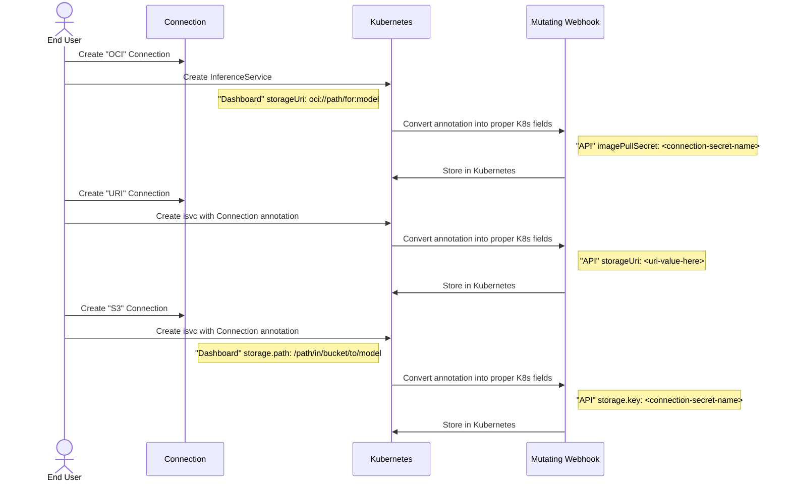

# Today's Connection Logic

## Workbenches

## Models (KServe)

### Technical Details - 3.0

Notebook side

* `opendatahub.io/connections: "<connection-secret-name>"`
  * Mount as env var
* `opendatahub.io/connection-type-method: "<value>"`
  * Ignored

Model Side
* `opendatahub.io/connections: "<connection-secret-name>"`
  * Hookup for the mutating webhook to kick in
* `opendatahub.io/connection-type-method: "<value>"`
  * OCI -- Connects via OCI logic (`imagePullSecret`)
  * URI -- Connects via URI logic (`storageUri`)
  * S3
    * `Kind: InferenceService` -- connects via `storage.key` & `storage.path`
    * `Kind: LLMInferenceService` -- connects via `model.uri` with `s3://` protocol
      * This needs SA support
  * _something else_
    * Reject?
  * _missing_
    * ??? Support URI?

### Technical Details - 3.1+

* Support for good separation
  * `opendatahub.io/connection-path: "<model-path>"`
    * S3 -- path inside bucket
      * OLD way -- put into `storage.path`
      * NEW way -- put into `s3://bucket/{path}`
    * OCI -- full qualified OCI (aka URI) path `oci://path/for:model`
* Dashboard "plays no more role" in connections being "connected"
  * This gets away from the two source problem
