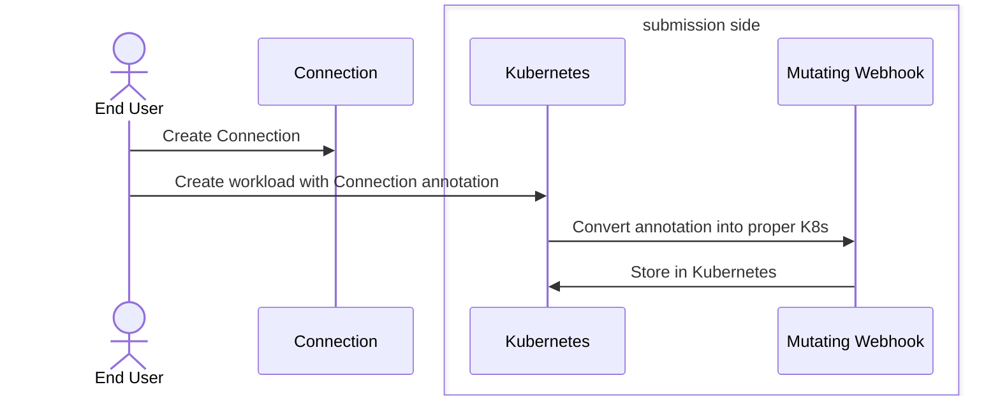

<!--
participant CT as Connection Type

-->



<!--
```mermaid
    actor EndUser as End User
    participant DashboardUI as Dashboard UI (Browser)
    box Dashboard Pod
    participant OAuth as OAuth Proxy Container
    participant Dashboard as Dashboard Container
    end

    EndUser->>DashboardUI: https://dashboard-route/*
    DashboardUI-xOAuth: (Not logged in)
    OAuth-\->>DashboardUI: Return log in screen
    EndUser->>DashboardUI: (log in)
    DashboardUI->>OAuth: (successful log in)
    OAuth->>Dashboard: Redirect to Dashboard
    Dashboard->>OAuth: Return HTML Page
    OAuth->>DashboardUI: (forwarded)<br/>Return HTML Page

```
-->
